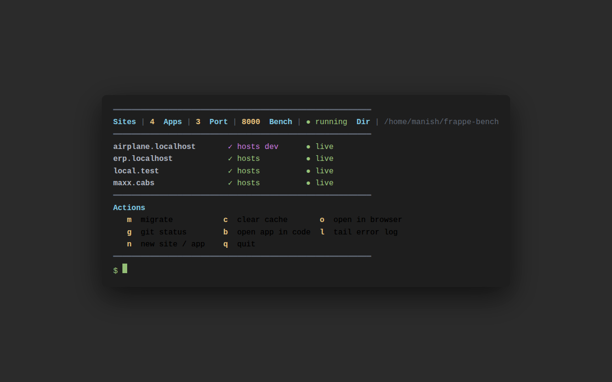

# bench-status

One-screen dashboard for your Frappe bench. See all your sites, hosts, and apps — then run common commands without leaving the terminal.



## Install

```bash
curl -sL https://raw.githubusercontent.com/dadsena01/frappe-bench-status/main/install.sh | bash
```

No dependencies beyond what you already have. Run `bench-status` from anywhere after install.

**Uninstall**: delete the symlink (`rm ~/.local/bin/bench-status`) and the script (`rm <bench-dir>/bench-status`).

## How it works

A single bash script that lives in your bench directory. Symlinked to `~/.local/bin/` so it's always in PATH. Reads your bench filesystem — no database queries, no API calls, no config changes.

## Features

### Dashboard

When you run `bench-status`, it shows:

| Column | What it means |
|---|---|
| **Site** | All sites found in `sites/*/site_config.json` |
| **Host** | ✓ if the site has a `/etc/hosts` entry, ✗ if not. Shows `dev` if `developer_mode=1` |
| **Status** | ● live if the bench port is listening, ○ idle if not |

The header bar shows total sites, total apps, port, whether bench is running, the default site (if set via `bench use`), and the bench path.

### Interactive actions

| Key | Action |
|---|---|
| `m` | Migrate a site |
| `c` | Clear cache on a site |
| `o` | Open a site in browser |
| `g` | Git status across all apps |
| `b` | Open an app in VS Code |
| `l` | Tail last 5 error log lines per site |
| `n` | Create a new app or new site |
| `q` | Quit |

### New site/app wizard

Press `n` to start:

1. Choose **New app** or **New site**
2. **New app**: enter a name → runs `bench new-app` → runs `bench setup requirements`
3. **New site**: enter a name → pick apps to install by number (space-separated, or 0 for none) → runs `bench new-site` with selected apps → runs `add-to-hosts`

### Auto-show on cd

The install script asks whether you want this. If yes, every time you `cd` into the bench directory, `bench-status` runs automatically. Controlled by a `PROMPT_COMMAND` hook in `.bashrc`.

## Requirements

- **bash 4.3+** — needed for the `pick()` function (uses nameref `local -n`)
- **`bench`** in PATH — obviously
- **`ss`** — for port check (ships with `iproute2` on Linux, installed by default)
- **`python3`** — optional, used for parsing `common_site_config.json`. Falls back to port 8000.

Works on Linux. Should work on macOS if you have the same tools.

## Contributing

Issues, feature requests, and pull requests welcome. Feature backlog (not yet implemented):

| Key | Feature |
|---|---|
| `r` | Restart bench web process |
| `u` | Update apps (pull + build + migrate) |
| `k` | Backup a site |
| `d` | Show database sizes |
| `s` | Open Frappe Python console |
| `p` | Show process stats (CPU/memory) |
| `a` | Clear Redis cache |
| `t` | Run tests for an app |
| `=` | Show disk usage |

Open an issue or PR if you want to work on one.

## License

MIT. Do whatever you want with it.
